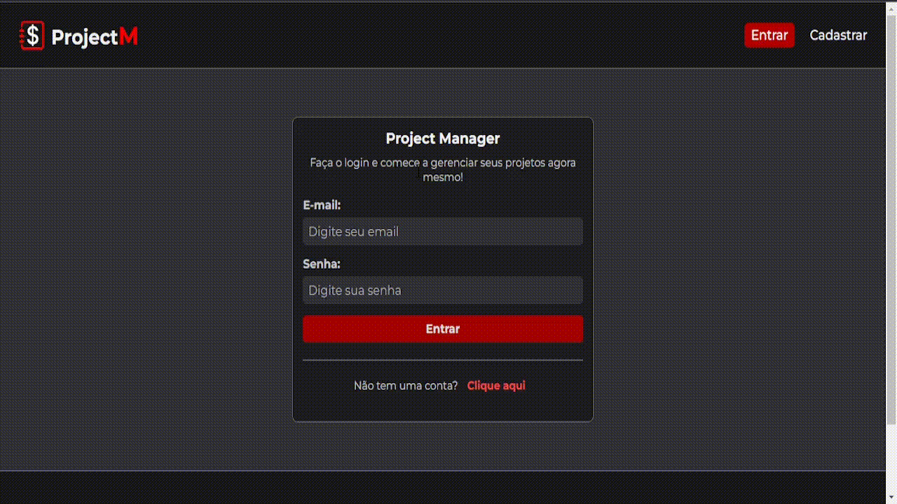
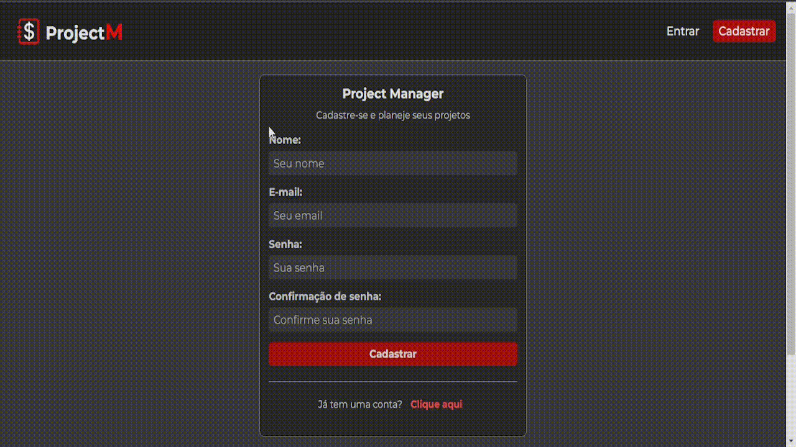
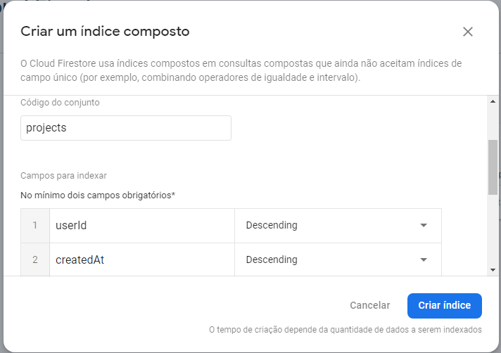
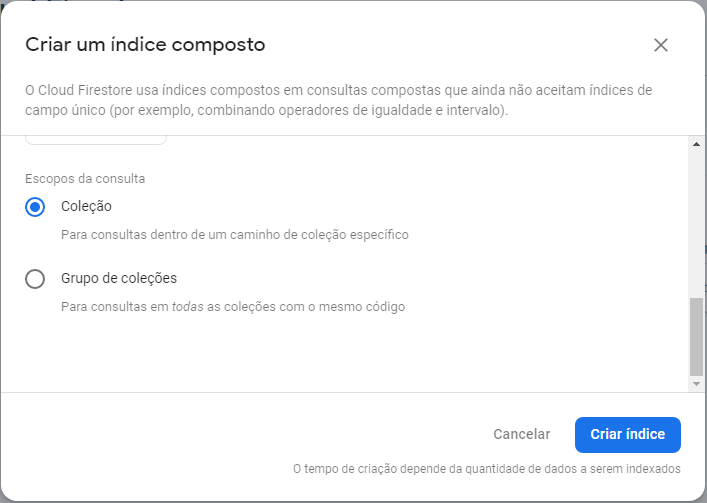

# ProjectM - Gerenciador de custos de projeto

Aplicação de gerenciamento de custos de projeto construída com ReactJS e Firebase. Nesta aplicação, cada usuário terá sua conta, onde poderá criar projetos, definir um valor de orçamento, e adicionar serviços ao projeto com base no valor do orçamento definido. A aplicação possui um foco na gestão empresarial.

- Criação de conta e projeto


<br />

- Edição de projeto e criação de serviços


<br />

- Regras de negócio do orçamento


<br />

- Usuários diferentes


<br />

- Validações de autenticação


<br />

- Layout Responsivo


## 💻 Tecnologias utilizadas
As seguintes ferramentas foram utilizadas na construção do projeto:
- [Javascript](https://developer.mozilla.org/en-US/docs/Web/JavaScript) | [HTML](https://developer.mozilla.org/en-US/docs/Web/HTML) | [CSS](https://developer.mozilla.org/en-US/docs/Web/CSS)
- [ReactJS](https://reactjs.org/)
- [React Icons](https://react-icons.github.io/react-icons/)
- [React Router Dom](https://reactrouter.com/en/main)
- [Firebase](https://firebase.google.com/)
- [Create React App](https://github.com/facebook/create-react-app)

## 🚀 Funções/Recursos
Principais funções e recursos da aplicação:
- **Autenticação:** autenticação de usuários por e-mail e senha, utilizando o serviço [Firebase Authentication](https://firebase.google.com/docs/auth).
- **Armazenamento:** armazenamento de dados em nuvem, utilizando o serviço [Firebase Cloud Firestore](https://firebase.google.com/docs/firestore).
- **Roteamento:** rotas protegidas com base na autenticação de usuário, utilizando [React Router Dom](https://reactrouter.com/en/main).
- **Flash Messages:** mensagens rápidas para indicar o sucesso ou falha de alguma ação na aplicação.
- **Validações:** validações de formulários com base nas regras de negócios da aplicação.
- **Responsividade:** layout responsivo que se ajusta aos diferentes tamanhos de tela.

## 🛠 Pré-requisitos
- Criar um [projeto no firebase](https://firebase.google.com/docs/web/setup?authuser=0&hl=pt#create-project).
- Configurar o serviço [Authentication](https://firebase.google.com/docs/auth/web/password-auth?hl=pt&authuser=0#before_you_begin) para e-mail e senha.
- Criar um banco de dados do [Cloud Firestore](https://firebase.google.com/docs/firestore/quickstart?hl=pt&authuser=0#create).
- Configurar os [índices do Cloud Firestore](https://firebase.google.com/docs/firestore/query-data/indexing?authuser=0&hl=pt#use_the_firebase_console) desta maneira:

    
    

- Ter instalado o [Git](https://git-scm.com/) e o [NodeJs](https://nodejs.org/en/).

# ⚙ Como rodar a aplicação
Com o auxílio de um terminal, precisamos rodar alguns comandos para executar o projeto:
- Primeiro, clone este repositório:
    ```bash
    $ git clone https://github.com/luizfelipeapolonio/project_manager
    ```
- Acesse a pasta da aplicação:
    ```bash
    $ cd project_manager
    ```
- Instale as dependências:
    ```bash
    $ npm install
    ```
- Agora, com o auxílio de um editor de códigos, criamos um arquivo `.env` na raíz da aplicação:

    

- Dentro do arquivo `.env`, coloque suas [variáveis de ambiente do firebase](https://firebase.google.com/docs/web/learn-more?authuser=0&hl=pt#config-object), seguindo este modelo:
    ```
    REACT_APP_API_KEY=
    REACT_APP_AUTH_DOMAIN=
    REACT_APP_PROJECT_ID=
    REACT_APP_STORAGE_BUCKET=
    REACT_APP_MESSAGING_SENDER_ID=
    REACT_APP_APP_ID=
    ```

- Com o auxílio do terminal novamente, na pasta raíz da aplicação (project_manager), damos o comando para iniciar a aplicação:
    ```bash
    $ npm start
    ```
- A aplicação irá abrir automaticamente no seu navegador na porta:3000, caso não abra, acesse http://localhost:3000

## 📝 Licença
Este repositório está licenciado pela **MIT LICENSE**. Para mais informações detalhadas, leia o arquivo [LICENSE](./LICENSE) contido neste repositório.

## Autor
Feito com 💜 por luizfelipeapolonio
